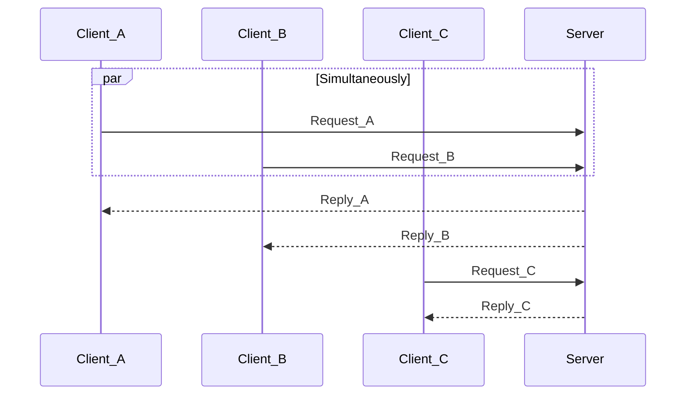
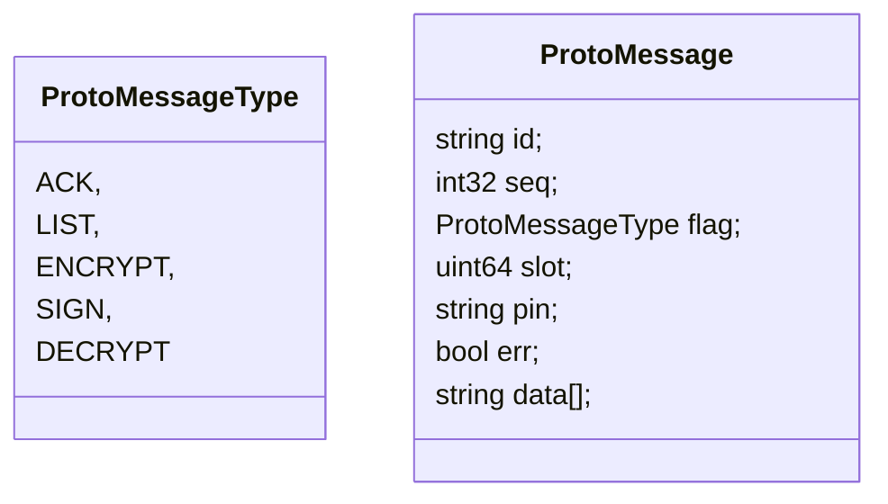

# PKCS11 Server x Client
## Introduction




[PKCS11](https://thalesdocs.com/gphsm/ptk/5.9/docs/Content/PTK-C_Program/intro_PKCS11.htm)
`Server` and `Client` implementations of a distributed system, where a separate server hosting either a 
_SoftHSM_ or an actual hardware accelerator guards access to confidential keys and associated cryptographic operations. 
This is done leveraging the [cryptoki](https://github.com/parallaxsecond/rust-cryptoki) crate which complies to the `PKCS11`
standard on how to uniformly interface with hardware security modules.
The `Client` binary as seen in [src/client.rs](/src/client.rs), launches `N` client threads based on supplied command-line arguments. Each client contains a series of server requests as detailed in a specified file, sending and awaiting on request responses concurrently.
The `Server` binary, as seen in [src/server,rs](/src/server.rs) accepts client connections and 
correctly replies to their simultaneous requests. The server holds mutex-protected accesses to the different slots 
previously created with the `softhsm2-util` executable and multiplex simultaneous requests using the 
[tokio-rs](https://tokio.rs/) framework. Messages between clients and the server are structured through 
[protobufs](https://protobuf.dev/) and are also described below.




## Dependencies
- [SoftHSM](https://github.com/softhsm/SoftHSMv2)
- [Cryptoki](https://github.com/parallaxsecond/rust-cryptoki)
- [Tokio](https://github.com/tokio-rs/tokio)
- [Protobufs](https://protobuf.dev/)

```bash 
sudo apt update
sudo apt install softhsm2 opensc
 sudo apt install libprotobuf-c-dev libprotobuf-dev protobuf-compiler protobuf-codegen
```

## Setup
0. Verify library path: 
```bash 
find /usr/lib/ -name "libsofthsm2.so"
```

1. Add user to `softhsm` group:
```bash
sudo usermod -aG softhsm $(whoami)
```

2. Initialize token:
```bash 
softhsm2-util --init-token --slot 0 --label "MyToken" --pin 1234 --so-pin 1234
```

3. Verify token slots:
```bash 
softhsm2-util --show-slots
```

4. Generate key-pair 
```bash 
pkcs11-tool --module /usr/lib/softhsm/libsofthsm2.so --login --pin 1234 --keypairgen --key-type rsa:2048 --id 01 --label "TestKey"
```

5. Verify key-pair 
```bash 
pkcs11-tool --module /usr/lib/softhsm/libsofthsm2.so --login --pin 1234 --list-objects
```

### Example
```bash 
softhsm2-util --init-token --slot 0 --label "MyToken" --pin 1234 --so-pin 1234
pkcs11-tool --module /usr/lib/softhsm/libsofthsm2.so --login --pin 1234 --keypairgen --key-type rsa:2048 --id 01 --label "TestKey"

softhsm2-util --init-token --slot 1 --label "Token2" --pin 5678 --so-pin 5678
pkcs11-tool --module /usr/lib/softhsm/libsofthsm2.so --login --pin 5678 --keypairgen --key-type rsa:2048 --id 02 --label "Key2" --slot 1482650756

softhsm2-util --init-token --slot 2 --label "Token3" --pin 3456 --so-pin 3456
pkcs11-tool --module /usr/lib/softhsm/libsofthsm2.so --login --pin 3456 --keypairgen --key-type rsa:2048 --id 03 --label "Key3" --slot 1125575704


```
